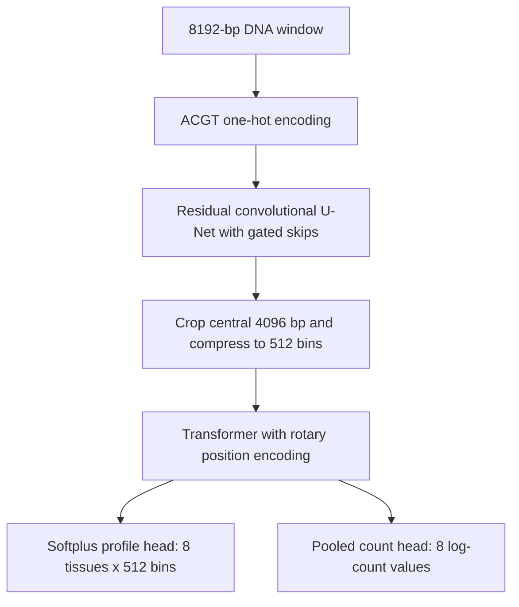

# PhytoRegNet: minimal inference release

[中文说明](README.zh-CN.md)

PhytoRegNet predicts tissue-resolved chromatin-accessibility signal from DNA
sequence. This standalone release provides the model, two trained example
checkpoints and a FASTA prediction command for manuscript review.

Each input is **8,192 bp**. The model predicts the central **4,096 bp** as
**512 bins of 8 bp**, across eight tissue outputs. It also predicts a separate
log-transformed total signal for each tissue.

## 1. Install

Use Python **3.10–3.12**. A CPU is sufficient for the examples.

On x86-64 Linux or Windows, create a virtual environment from this directory:

```bash
python3 -m venv .venv
source .venv/bin/activate
python -m pip install -r requirements-cpu.txt
python -m pip install .
```

On Windows, activate with `.venv\Scripts\activate` instead of `source`.
The CPU requirements pin PyTorch 2.6.0 and NumPy 1.26.4. Only PyTorch and
NumPy are required by the prediction code. The installation and both examples
were verified on Linux with Python 3.12.7, PyTorch 2.6.0+cpu and NumPy 1.26.4.

On Apple Silicon macOS, use `python -m pip install torch==2.6.0 numpy==1.26.4`
instead of the CPU requirements file, then run `python -m pip install .`.

Alternatively, create a Conda environment and install the package:

```bash
conda env create -f environment.yml
conda activate phytoregnet-minimal
python -m pip install .
```

For an NVIDIA GPU, install the corresponding PyTorch wheel before installing
this package. For example, the PyTorch 2.6.0 CUDA 11.8 build is:

```bash
python -m pip install torch==2.6.0 --index-url https://download.pytorch.org/whl/cu118
python -m pip install .
```

Select a wheel compatible with your driver using the
[official PyTorch installation instructions](https://pytorch.org/get-started/previous-versions/#v260).
CPU inference is the default; GPU inference uses `--device cuda:0`.

## 2. Run the example

The two bundled checkpoints are the original **fold 0** Arabidopsis and rice
Nipponbare (NIP) source models. Each command performs **single-checkpoint**
inference. The example FASTA contains two synthetic 8,192-bp windows to
demonstrate the interface.

```bash
phytoregnet-predict \
  --model arabidopsis \
  --checkpoint weights/arabidopsis/fold_0.pt \
  --fasta examples/demo.fa \
  --output-prefix outputs/arabidopsis_demo
```

Use the NIP model with the same interface:

```bash
phytoregnet-predict \
  --model rice_nip \
  --checkpoint weights/rice_nip/fold_0.pt \
  --fasta examples/demo.fa \
  --output-prefix outputs/rice_demo
```

The same command is available as `python -m phytoregnet_minimal`.
Check `phytoregnet-predict --help` for batch size, CPU threads and device options.
Checkpoint SHA-256 values are provided in [weights/manifest.json](weights/manifest.json).

## 3. Supply your own DNA

Create a FASTA containing one or more windows:

```text
>window_1
ACGT...8192 bases in total...
>window_2
ACGT...8192 bases in total...
```

Every record must contain exactly **8,192 bases**, with a unique identifier.
Multiline FASTA and lowercase bases are accepted. A/C/G/T are one-hot encoded
in that order; **N** uses four zeros. Other letters, empty records and incorrect
lengths produce an error. Prepare fixed-length windows before prediction.

The predicted interval is `[2048, 6144)` relative to the beginning of each
FASTA record, using zero-based, half-open coordinates. Bin `i` covers
`[2048 + 8*i, 2056 + 8*i)`. The final bin is `[6136, 6144)`.

## 4. Read the predictions

Each run writes:

| File | Contents |
| --- | --- |
| `PREFIX.npz` | Complete profile and count arrays, sequence IDs, tissue names and bin coordinates |
| `PREFIX.counts.tsv` | One row per sequence and tissue, with raw log count and inverse-transformed count |
| `PREFIX.metadata.json` | Model configuration, checkpoint checksum, dimensions and inference settings |

Add `--profile-tsv` to also write `PREFIX.profile.tsv`, one row per sequence,
tissue and bin. Existing files are preserved unless `--overwrite` is supplied.

Read the NumPy archive with:

```python
import numpy as np

with np.load("outputs/arabidopsis_demo.npz", allow_pickle=False) as result:
    print(result["sequence_ids"])
    print(result["track_names"])
    print(result["profile"].shape)    # (2, 8, 512): sequence, tissue, bin
    print(result["log_count"].shape)  # (2, 8): sequence, tissue
    print(result["profile"][0, 0])    # first sequence, root, all 512 bins
```

`profile` is a nonnegative prediction on the **training-normalized signal
scale**; it is a Softplus output, rather than a probability distribution.
`log_count` is the independent head's prediction of `log(1 + total normalized
signal)` over the central 512 bins. `count` is `max(expm1(log_count), 0)`.
The original `log_count` is retained even when negative. The profile sum and
inverse-transformed count are separate estimates and need not be equal.

## 5. Tissue order

Array channels follow checkpoint training order:

| Index | Arabidopsis | Rice NIP key | Rice NIP label |
| --- | --- | --- | --- |
| 0 | root | callus | Callus |
| 1 | seedling | embryo | Plumule |
| 2 | seed | meristem | Apical meristem |
| 3 | inflorescences | female_reproductive_tissue | Pistil |
| 4 | fruit | male_reproductive_tissue | Stamen |
| 5 | leaf | root | Root |
| 6 | shoot | stem | Stem |
| 7 | flower | leaf | Leaf |

Machine keys retain their historical names for checkpoint compatibility;
`track_labels` supplies the corresponding display names.

## 6. Prediction logic



Prediction uses float32, `model.eval()` and `torch.inference_mode()` in the
supplied sequence orientation. Each command loads one checkpoint, with strict
parameter matching. The original module names are retained so published
state dictionaries can be loaded directly. Model configurations and tissue
orders are packaged with the code.

For a direct Python interface:

```python
from phytoregnet_minimal import Predictor
from phytoregnet_minimal.sequence import read_fasta

ids, sequences = read_fasta("examples/demo.fa")
predictor = Predictor("arabidopsis", "weights/arabidopsis/fold_0.pt", device="cpu")
result = predictor.predict(sequences, batch_size=2)
profile = result["profile"]
log_count = result["log_count"]
```

## 7. Files

```text
PhytoRegNet_minimal/
├── README.md / README.zh-CN.md
├── pyproject.toml
├── requirements-cpu.txt / environment.yml
├── src/phytoregnet_minimal/
│   ├── model.py              Model blocks and forward pass
│   ├── inference.py          Configuration and checkpoint loading
│   ├── sequence.py           FASTA parsing and one-hot encoding
│   ├── cli.py                Prediction command and output writing
│   └── configs/              Arabidopsis and NIP inference configurations
├── examples/demo.fa
└── weights/                  Two original fold 0 checkpoints and manifest
```

This directory is the root of the standalone reviewer repository.
The code and configuration form an installable package. Keep the
`weights/` and `examples/` directories beside the source when distributing the
reviewer checkout; they are external assets rather than Python wheel contents.
